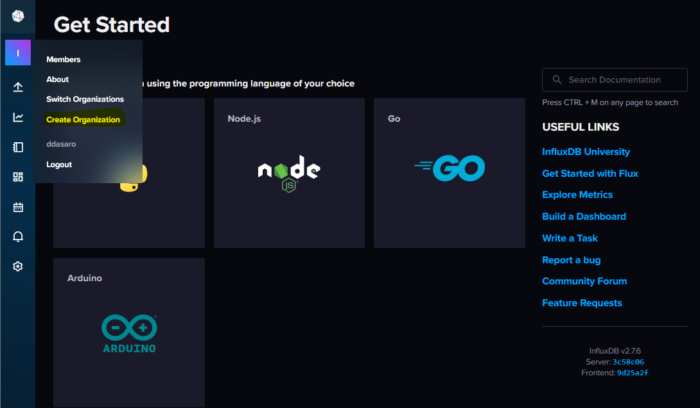
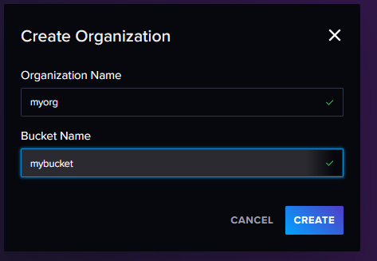
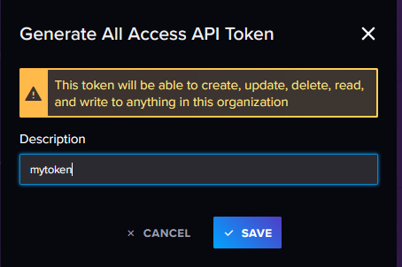
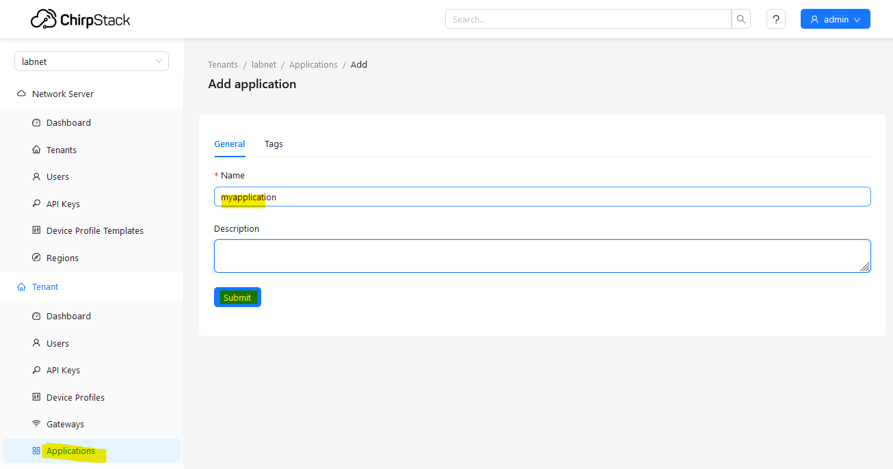
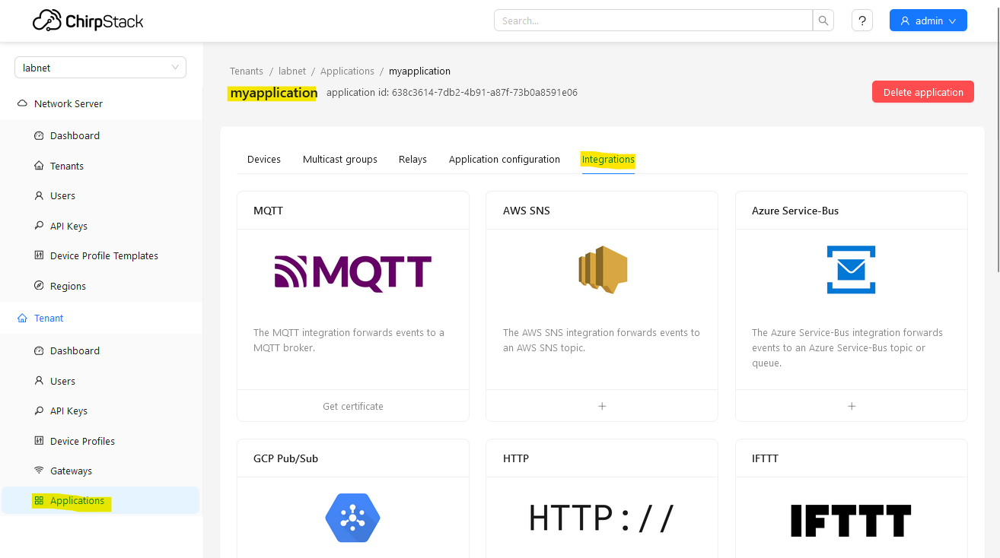
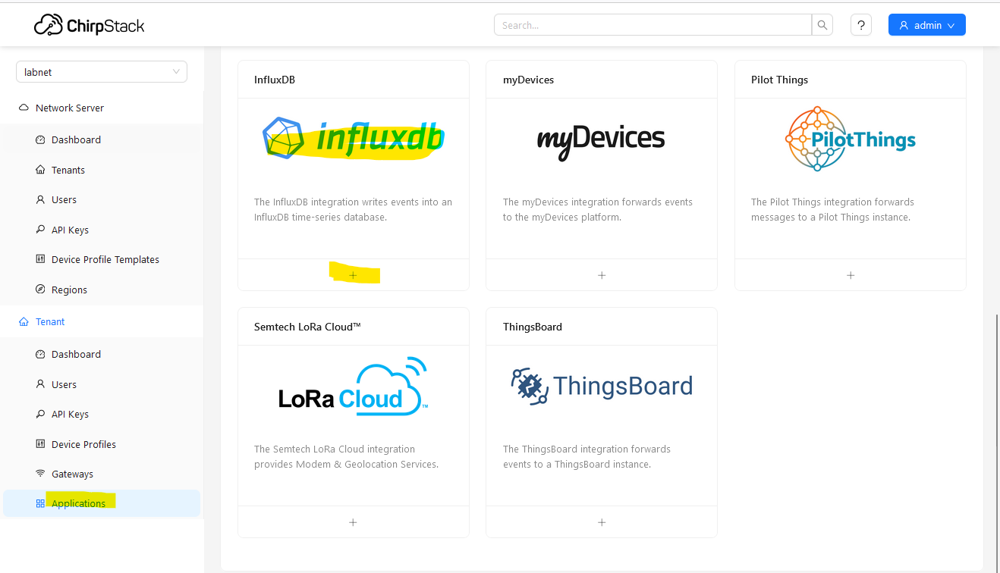

## introduction

I don’t know if my experience with LoRaWan and my personal use of BresserWeatherSensorLW project can interesting someone, but I am happy to share what I have realized for my experiment.

I'm completely new on LoRa an LoRaWan and on all other components that I have decided to use. My approch is very basic and i think that my description is not usefull for advance users. I think instead that could be usefull for users that now are starting the trip on this world.

When we start talking about LoRaWan, we should also talk about its fundamental elements.

- network server
- gateway
- device
- application server

Instead of using a public LoRaWan network (as for example TTN), I have decided to implement my personal private one.

### network server
To implement a LoRaWan Network Server, I have choose to use ChirpStack (https://www.chirpstack.io) installed on a virtual machine in my lab enviroment.
ChirpStack is an open source solution to implemente a LoRaWan Network Server. Documentation is availabe, clear and simple, so it is not necessary that i explain here any other information.

### gateway
It is necessary to choose a solution that covers everyone's personal needs.
For my personal need, I have decide to use a Raspberry PI 4 with RAK2245 PI HAT and ChirpStack Gateway OS (https://www.chirpstack.io/docs/chirpstack-gateway-os/index.html).
Also in this case, documentation is quiet simple and clear.

### device
I have used an "Heltec wifi LoRa 32 v3" board, but for Matthias **BresserWeatherSensorLW** firmware, each compatible hardware list in initial project documentation, can be a good choise.

After initial configuration on LoRaWan Network server and in **BresserWeatherSensorLW** code we can burn the board and if everything goes right, on LoRaWan Network Server console, you can see data (as air temp, but not only) coming from device as uplink.

### application server
Now we can speak about application server.
I have decide to use InfluxDB to store my data as timeseries. So InfluxDB server will assume Application Server role (we can have multiple application server based on yours needed).
We need to install a InfluxDB server, and at https://docs.influxdata.com/influxdb/v2/install/ we can choose the InfluxDB installation that we prefer and all info to do that.

After InfluxDB installation, we need to configure: Organization, Bucket and Token.

In the images below ypu can see how do this.

+ create organization and bucker

+ create api token

Now, we have all elements and parameters, including the URL to access the management API, needed for next step.

#### Note:
Each public LoRaWan Network provider, offer some specific interface an features to connect to an applcation server, also ChirpStack (as a LoRaWan Network Server) is not different. What i'm going to write, i think could cover a large amount of situations.

For integrating ChirpStack and InfluxDB we need to:

+ create an application

+ create a connection to application server (InfluxDB in our case), using a small number of simple paramenter, as:
  - InfluxDB version 
  - API endpoint (write) - http://InfluxDB:8086/api/v2/write (as example)
  - Organization (defined on InfluxDB side) -> my case "labnet"
  - Bucket       (defined on InfluxDB side) -> my case "ChirpStack"
  - Token        (defined on InfluxDB side)

At this point ChirpStack write data coming from device into InfluxDB.

## Exploring data inside InfluxDB

At this point, my first challenge was understanding how to explore data in InfluxDB.

first   - from the left column on icon "I" select the organization create before 
second  - always from the left column on incon "arrow up", click on buckets and select create before

a data explorer interface are presented and here you are drive thru query creation.
 from left to right you can create parameter for query
 in my case: 
	- from:		chirpstack
	- filter:	device_name		-> and select device name create on LoRaWan console
	- filter:	_measurement	-> device_frmpayload_data_bytes_air_temp_c - the name defined by matthias code (for air temp)
	- filter:	_field			-> value
 now click on submit button.
 
 i suppose the you receive an error "unsupported input type for mean aggregate: string", if so, near "submit" button click on "script editor". now you switch to manual query writer and you can see the query code that you write with gui support.
 
 from(bucket: "chirpstack")
  |> range(start: v.timeRangeStart, stop: v.timeRangeStop)
  |> filter(fn: (r) => r["device_name"] == "node_02")
  |> filter(fn: (r) => r["_measurement"] == "device_frmpayload_data_bytes_air_temp_c")
  |> filter(fn: (r) => r["_field"] == "value")
  |> aggregateWindow(every: v.windowPeriod, fn: mean, createEmpty: false)
  |> yield(name: "mean")
  
  to be able to represent date in "graph" visualization type, you need to cast data from string to float, so add "|> toFloat()" as show below and than click on "submin" button
  
 from(bucket: "chirpstack")
   |> range(start: v.timeRangeStart, stop: v.timeRangeStop)
   |> filter(fn: (r) => r["device_name"] == "node_02")
   |> filter(fn: (r) => r["_measurement"] == "device_frmpayload_data_bytes_air_temp_c")
   |> filter(fn: (r) => r["_field"] == "value")
   |> toFloat()
   |> aggregateWindow(every: v.windowPeriod, fn: mean, createEmpty: false)
   |> yield(name: "mean")

this is the first simple query that i have write.

from gui you can select the time frame you want and also decide to save you query and visualization in a dashboard.
if you don't have any dashboard, you can create one at the moment.

at the same dashboard you can add all visualization/query that you want

[def]: #exploring-data-inside-influxdb